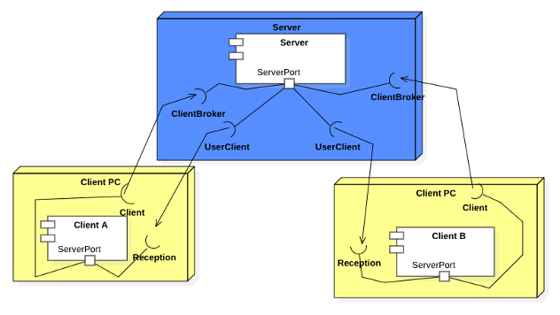
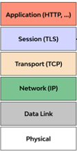
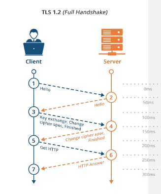
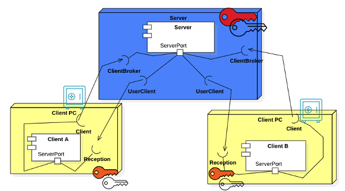

# CSCY-3765 Laboratory #3: Secure Networking

## Learning Goals
- This lab is intended to provide practical experinece into securing point to point communications using sockets.

## The Problem Domain
- The application we are building consist on a messaging system. 
- Basically we have two applications: a _client_ that is used by users to send messages to other users, and a _server_ which operates as a relay. So when Client A sends a message to Client B, A is connected to the server and so is B. A send the message to the server, which relays it back to the client used by B.

## Starting Point
- You are provided with the implementation of a multi-threaded client-server messanging system. 
    - We yet have to discuss multi-threaded applications. You should not dispair as you will not focus on the multi-threaded implementation today, just on the networking. 
    - A basic notion of how the application work is given below.

### The overall architecture

### The Server
- The server consist of three main classes.
    - The `Server.java` that the main purpose is to listen for incomming connections. 
    - The `ClientBroker.java` which represents each thread. 
        -As a connection request from a client arrives, the server creates a new thread (executing the run method) of a ClientBroker object to interact with that client. Thus the `ClientBroker` will hold the `Socket` connection with the client to receive3 and transmit packages. 
    - The `User.java` which will represent users connected to the messaging server.  
        - It will also connect to the client reception socket. This will allow a bi-directional synchronous communication. 

### The Client
- It is a GUI application that hosts connections to the server and establishes a reception server as well. 
- When the User throught he client connects to the server, the Server connects back to the client using the reception server connection. 
- The main two classes are:
    - `Client.java` which represent the outgoing communication channel. 
        - This connects to the server to send messages to other users. 
    - `IncomeMsg.java` which starts a server on a separate thread. When the client connects to the server, the server connects back to a socket acception connections handled by this class. This will allow receiving messages relayed by the server.

## SSL/TLS
- Secure Socket Layer (SSL) and Transport Layer Security (TLS) are cryptographic protocols that provide authentication and data encryption between servers, machines, and applications operating over a network.
- Both SSL and TLS protocols are conceptually similar, but the key difference is how each achieves connection encryption.
- Both refer to the handshake process between the client and server.
- Secure = encryption/**C**onfidentiality + **I**ntegrity + **A**uthentication 

### TLS Handshake
- Handshake's goals are to authenticate the server and establish the encryption keys to use. 
- Through the exchange of messages, both the Client and Server negotiate protocols and share configuration parameters for communication. 
- Server authentication relies on PK.
- Additional mechanisms to prevent other attacks, like replay attacks, are included within the protocol.

### Goals of Using Encryption
- The attacker may run a sniffer to capture traffic.
    - Communication is C/S encrypted.
- DNS cache poisoning?  DHCP spoofing?
    - The client goes to the wrong server. → Server authentication by PK
- The attacker hijacks the connection and injects new traffic
    - Data receiver rejects due to failed integrity checks. 
- Man in The Middle Attack
    - Encryption → can't read and can't inject
    - Can't even replay previous TLS handshakes

### Secure Sockets in Java
- Secure Sockets are implemented in the `javax.net.ssl` package.
    - `import javax.net.ssl.SSLServerSocket;`
    - `import javax.net.ssl.SSLSocket;`
- Factories are provided to create SSL Sockets.
    - **For SSLSocket**
        - `sf = (SSLSocketFactory)SSLSocketFactory.getDefault();`
        - `sslSocket = (SSLSocket)sslFact.createSocket(ip, port);`
    - **For SSLServerSocket**
        - `sslSrvF = (SSLServerSocketFactory)SSLServerSocketFactory.getDefault();`
        - `serverSocket = (SSLServerSocket)sslSrvF.createServerSocket(port, backlog);`

### Certificates
- We need certificates for the server and a "trust store" for the clients. 
- Self-signed certificates can be generated with `keytool` available with JDK ([read the manual](https://docs.oracle.com/en/java/javase/17/docs/specs/man/keytool.html) and [read the docs](https://docs.oracle.com/cd/E19830-01/819-4712/ablqw/index.html)).

### Running SSL Applications
- Execution of SSL/TLS applications requires setting information about the certificates:
    - **Starting a Server:**
        - `java -Djavax.net.ssl.keyStore=keystore -Djavax.net.ssl.keyStorePassword=pass Server`

    - **Starting a Client:**
        - `java -Djavax.net.ssl.trustStore=truststore -Djavax.net.ssl.trustStorePassword=pass Client`

## Todos
1. Exploration [15 min]
    - The client and server provided are running applications. 
    - Open Each in a separate intelliJ project windows. 
    - Start a server
    - Start a Client A
    - Start a Client B
    - Use the app [2-5 minutes]
    - Look at the code given by the classess mentioned above. 
2. Secure the P2P communication using secure sockets. 
    - Divide the work. One student work in the client, one working on the server.
    - Will need to generate the certificates. 
        - a PKI for Server
        - a PKI for Client A
        - a PKI for Client B
    - Update the configuration for each one (3 total)
    - Test.

